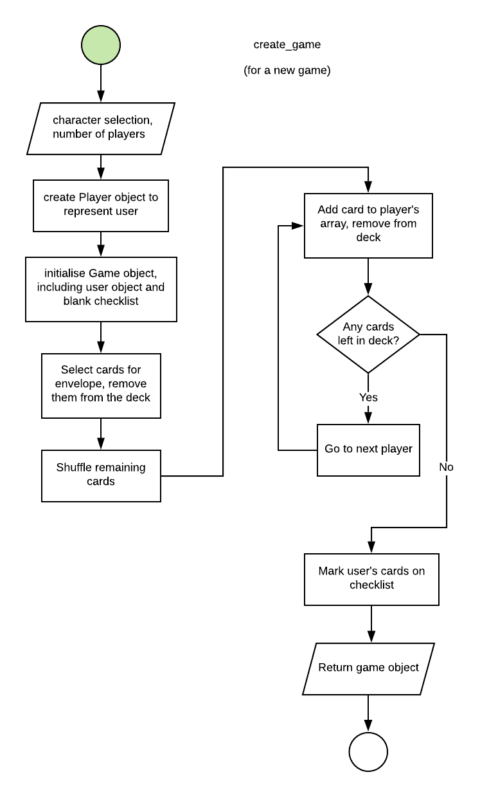
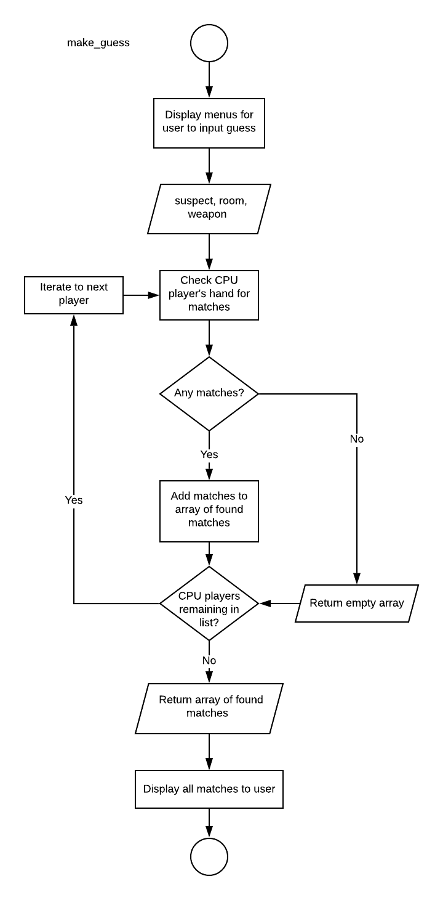
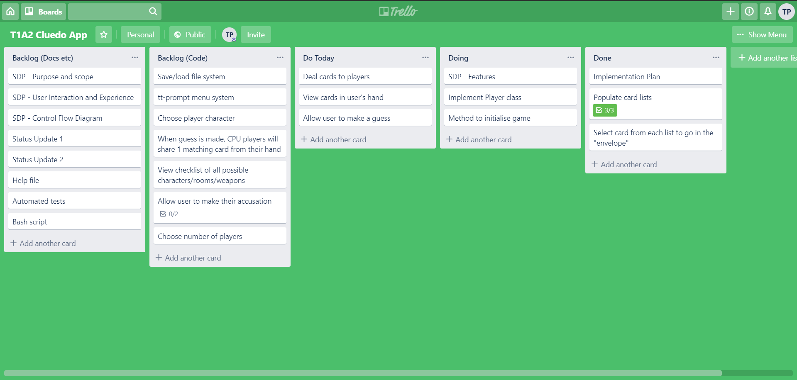
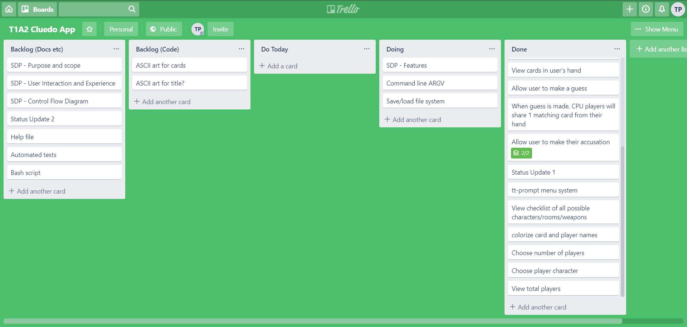
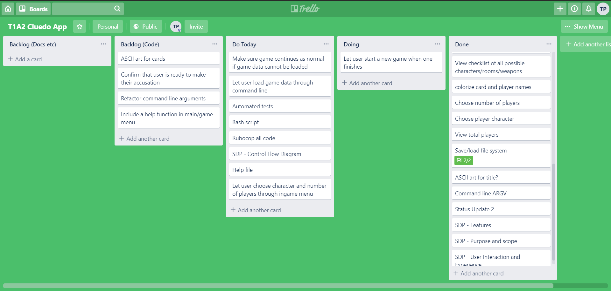

## Github - [cluedo-app](https://github.com/techspeterson/cluedo-app)

# Cluedo App - Help File
An app that lets you play Cluedo in your terminal.

## Installing
1. Install Ruby (works best in 2.5.5)

2. Clone this repository

```
git clone git@github.com:techspeterson/cluedo-app.git
```

3. Run the `build.sh` script in the command line:
```
bash build.sh
```
App files will be copied into `./dist` and all required gems will be automatically installed.

Gems used: `artii`, `colorize`, `tty-prompt`, `tty-table`

4. Navigate into `./dist` and run the main app file:
```
ruby app.rb
```
## Optional flags
Load game data:
```
ruby app.rb -l
```
Start a game as a specific character:
```
ruby app.rb -c plum
```
Start a game with a specific number of players:
```
ruby app.rb -p 5
```
## How to play
From the ingame menu, select **New game**, or **Load game** to load game data from `save-data.json` (if it exists).

Through the ingame menus, you can:

- **Guess the suspect, room and weapon** by selecting each component from the menu. If any of your opponents have a card you guessed, they'll show it to you.
- **View the checklist** of all the cards you've seen so far, to help narrow down your guesses.
- **Make your final accusation** when you're sure of the answer - if you get it right, you win! But if you get it wrong, it's game over!
- **Save your game** to an external file so you can resume later.


# Cluedo App - Software Development Plan

## Purpose and Scope
### What is the Cluedo App?
This app is a partial mockup of the board game Cluedo. In the original game, the players must solve a fictional murder that is defined by a character (the culprit), room location, and murder weapon. The total selection of suspects, rooms and weapons are represented by cards, three of which are randomly chosen at the start of the game and the rest distributed to up to 6 players. The Cluedo App cuts out the board game element, but still provides a 1-player game experience in which the user makes guesses as to the details of the murder. The guess is compared to the cards held by up to 5 CPU players in order to narrow down the possibilities, and eventually the user can make their final accusation and win the game (if they are correct).

### Why Cluedo?
The Cluedo App is designed for entertainment purposes and provides a means of playing a Cluedo-esque game without the need for a physical game board. Though the CPU players in the game do not actually compete against the user to correctly guess the murder first, and the player does not move around a game board, these are features that could potentially be implemented in the future. The app is targeted at anyone of ages 8+ who enjoys a straightforward mystery game.

### How to play
Upon running the Cluedo App the user can choose to **start a new game, or load an existing one** if external save data is available. The user could also choose to run the app with command line arguments to jump straight into the game with a user-defined player character and number of players. Three cards are chosen for the "envelope" that represents the murder, and the rest of the cards are distributed to the players and stored in their respective Player objects.

During the game loop, the user can select to **make a guess.** The user selects a suspect, room and weapon from the menu, and the selections are checked against the cards held by the CPU players. If there are any matches, each CPU player will have one of their matching cards displayed to the user. Shown cards are automatically **stored in a neatly formatted checklist** that the user can choose to view at any time, along with **game info such as the cards in the user's hand, and the number of other players.** The user can **save their game data to an external file** at any time.

When the user feels they have sufficient information to deduce the murder, they can choose to **make their final accusation,** where the user's guess is compared to the contents of the envelope. Whether their accusation is correct or not determines if the user wins the game.

## Features
- **Game Initialisation:** When starting a new game, the app will determine the winning combination of cards for the "envelope" and distribute the remaining cards to the players. The user is able to choose which character they are playing as, and how many CPU characters are present, through use of command line arguments. The user can also save and load game data with an external text file, which will store the players' hands, the contents of the envelope, and the list of cards that the player has seen.
- **Viewing Game Information:** The user can choose at any point during the game to view relevant game information. The user can see the cards in their hand, as well as the names of their player character and the CPU players. The user can also view a checklist of all the cards they have seen throughout the game laid out neatly in a table to aid in their guessing. Player names are displayed in the relevant colours, and cards are also colour coded by category to make them easier to distinguish. Navigation through options is done through a simple menu that requires minimal text input on the user's part.
- **Making Guesses:** The user progresses through the game by guessing the contents of the envelope - the suspect, room and weapon involved in the murder. The user selects an item from each of the categories to make their guess, and each item is checked against the hands of the CPU players. If the CPU characters have any of the chosen cards in their hands, they will each show one of these cards to the player. Information on all the cards the user has seen is stored in a viewable checklist. The user can choose to make their final accusation at any time, which will determine if they win or lose the game.

## User Interaction
The user interacts with the app primarily through ingame menus. These ingame menus allow the user to scroll through the available options in the terminal, requiring almost no text input on the user's part and largely eliminating the need for menu error handling. These scrolling menus are used throughout the game and also provide the benefit of displaying all available options for a menu on-screen for the user automatically. The `tty-prompt` functionality displays instructions for navigating through these menus.

The user is able to run the app while providing command line arguments, in order to define the player character and/or the number of players. These selections are formatted with the flag followed by the argument, for example `-c plum -p 5` will define the player **character** as Professor Plum and the total **player count** as 5. The app checks if the argument following each flag is valid; if an argument is invalid, a warning message is printed and a default value is used.

The user is able to save their game data to a predefined file path in the app directory, and load game data from that same file path if the file is available. The app will provide an error message and continue on as normal if the file does not exist.

## Known issues
- App does not currently check if data loaded in from an external file is valid save data
- Checklist table does not display properly if terminal window is too small
- Save file stores game data unencrypted, so the user could read the win conditions from the file

## Control Flow Diagram
Since most of the game takes place inside the game menu loop, rather than create a flowchart of the entire app's functionality I have provided flowcarts for these parts of the app's functionality:

- the `main_menu` method through which the user chooses to start a new game or load a save file
- the `create_game` method that runs when the user selects to start a game
- the `make_guess` method that runs when the user is making a guess






# Implementation Plan


# Trello Screenshots

## Link: [T1A2 Cluedo App](https://trello.com/b/V0fUqA5N/t1a2-cluedo-app)



